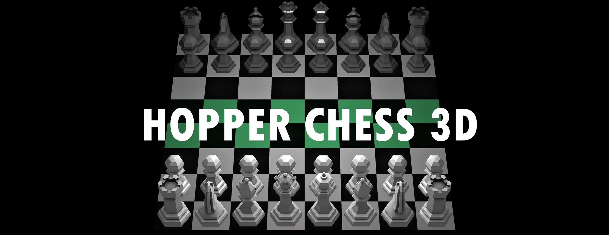

## Controls

The following can be used as a guide for controlling the camera and pieces.

Universal
```
P: Pause game, frees cursor so window can be resized or closed
O: Resume game, locks cursor
```
Camera Mode
```
W: Camera forward
S: Camera backward
A: Camera left
D: Camera right
Q: Camera down
E: Camera up
+: Increase FOV
-: Decrease FOV
SPACE: Switch to move input mode
I: Display information
ESCAPE: End program
```
Move Input Mode
```
ENTER: Execute move
SPACE: Cancel move
BACKSPACE: Switch to camera mode
```
